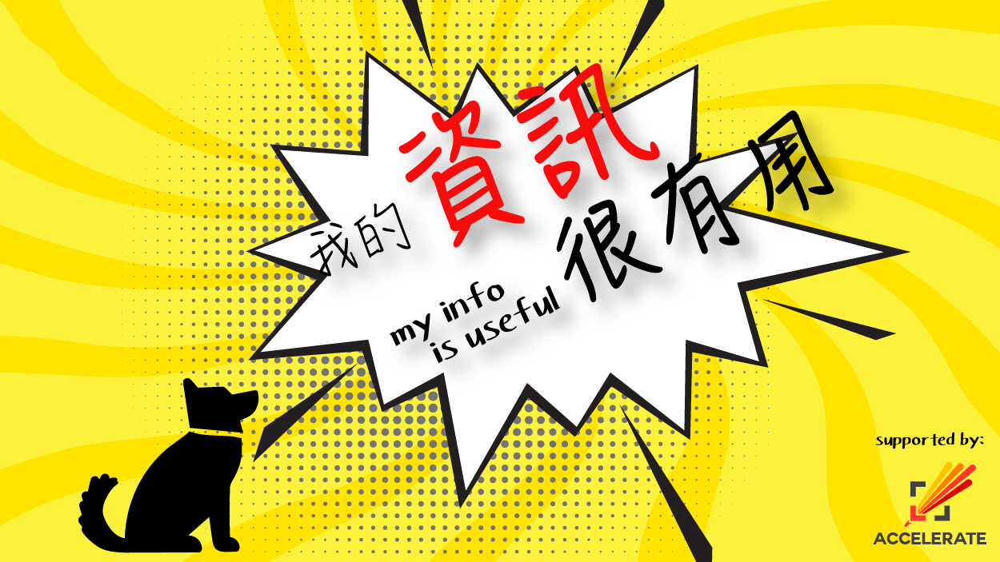

### Git Pitch - Powerpoint 終結者？

##### 我的資訊很有用
###### 2018-08-02
---
### Powerpoint 利與弊

* Powerpoint成日都要用，最大好處當然係方便易用。Google Slides令佢更上一層樓。
* 原因？ Powerpoint or Google Slides or Open Office 係 WYSIWYG editor
* Powerpoint keep 歷史好麻煩，個style又成日唔同
* 原因？ 因為佢係一個 WYSIWYG editor 

---
### GitPitch 點幫到你？

* 內容同styling 徹底分開，內容你打嘅係Markdown, styling 係由theme 控制，亦可以有custom theme
* 而因為內容係markdown，我地可以用我地最愛既Git 去 track住我地既powerpoint.
* 而亦由於內容係markdown，我地可以用我地最愛既Text Editor 去用。
* Styling 本身 GitPitch 係有一D built-in theme.
* 但係由於可以用 custom CSS 去控制，變相有好多變化。

---
### 示範

## 講多無謂，直接示範喇!


---
### 寫段Code 

```python
def hello(name):
    print("Hello " +name)

hello("world")
hello("my info is useful")
```

---
### 加張圖



---
### 左一張圖，右一段字
@transition[none]


@snap[east]

@snapend


@snap[west]
我的資訊很有用是香港第一個純技術討論的廣東話聚會，每月第一個星期四，於油麻地彌敦道557號Work Together 18樓，歡迎各位programmer及其他IT從業者、Accelerate現屆學生或校友參與！
@snapend
  
